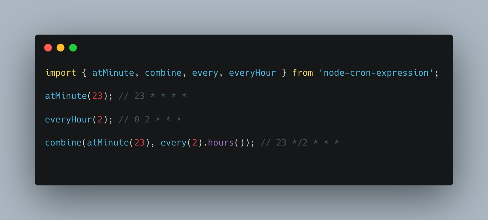

# node-cron-expression

[](https://github.com/merencia/node-cron-expression/blob/master/LICENSE.md)
[](https://img.shields.io/npm/v/node-cron-expression.svg)

**Declarative functional cron expression builder. Use it with tools like [node-cron](https://github.com/node-cron/node-cron) or [bull](https://github.com/OptimalBits/bull)**

[](./SS.png)

## Getting Started

Install `node-cron-expression` using npm:

```console
$ npm install --save node-cron-expression
```

Import `node-cron-expression` and build an expression

```javascript
const { onDayOfTheWeek, every, everyHour } = require('node-cron-expression');

console.log(onDayOfTheWeek(6)); // 0 0 * * 6
console.log(everyHour()); // 0 * * * *
console.log(every(8).hours()); // 0 */8 * * *
```

## Documentation

Find all available methods with examples [here](https://kbariotis.github.io/node-cron-expression).

## Issues

Feel free to submit issues and enhancement requests [here](https://github.com/kbariotis/node-cron-expression/issues).

## Contributing

In general, we follow the "fork-and-pull" Git workflow.

- Fork the repo on GitHub;
- Commit changes to a branch in your fork;
- Pull request "upstream" with your changes;

NOTE: Be sure to merge the latest from "upstream" before making a pull request!

Please do not contribute code you did not write yourself, unless you are certain you have the legal ability to do so. Also ensure all contributed code can be distributed under the ISC License.

## License

node-cron-expression is under [MIT License](./LICENSE).
